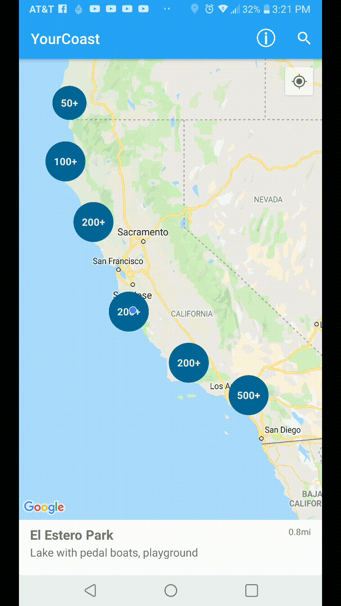

# YourCoastAndroid
*Created in part by: Joseph Antongiovanni, David Beach, Morgan Hamilton, and Brian Martinez.*

YourCoast Android is an application that shows over 1,500 California coastal locations, and allows users to discover and search for ammenities like parking, disabled access, restrooms, and more.

## User Stories

- [x] User can search a location via plotted map points.
- [x] User can search a location by name.
- [x] User can view photos of each location.
- [x] User can view amenities of each location.
- [x] User can call each location.
- [x] User can get directions to each location.
- [x] User can read information about the California Coastal Commission.
- [x] User can email the California Coastal Commission.
- [x] User can upload a photo as a request for submission to the database.
- [ ] User can filter locations according to their amenities.

## Video Walkthrough

Here's a walkthrough of implemented user stories:

